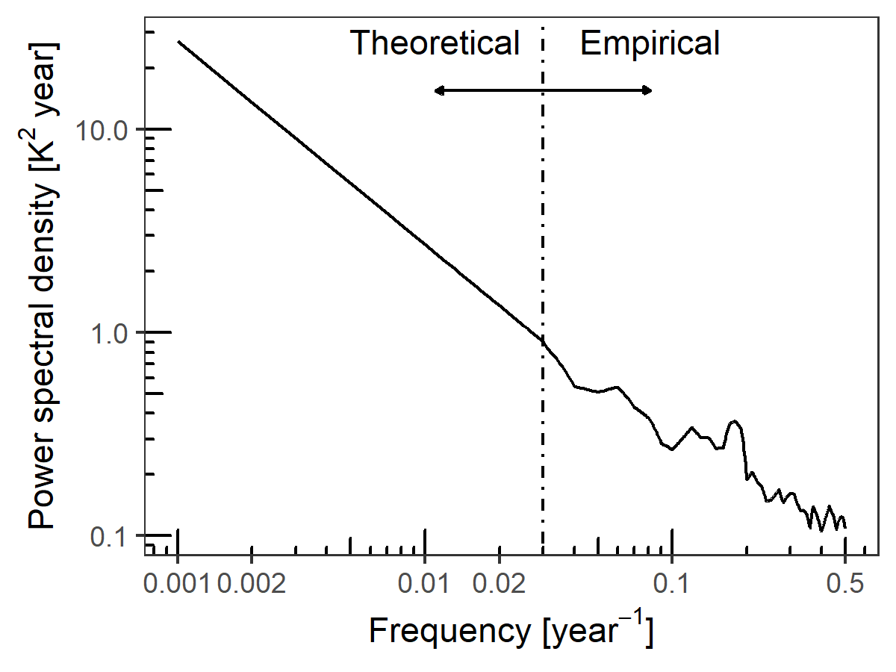
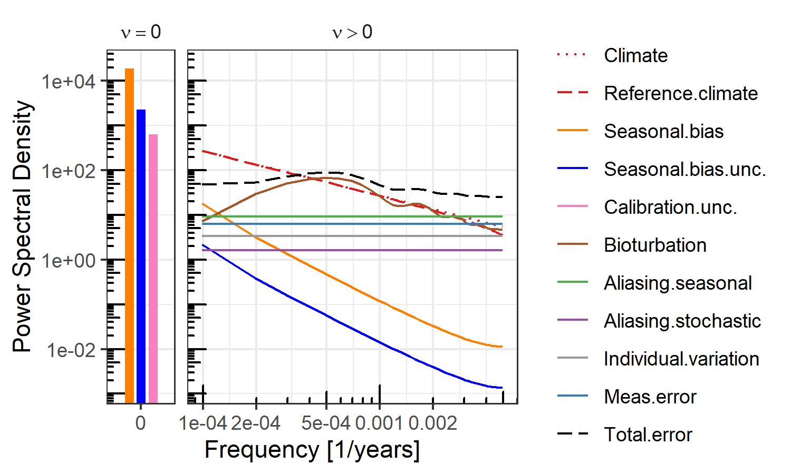
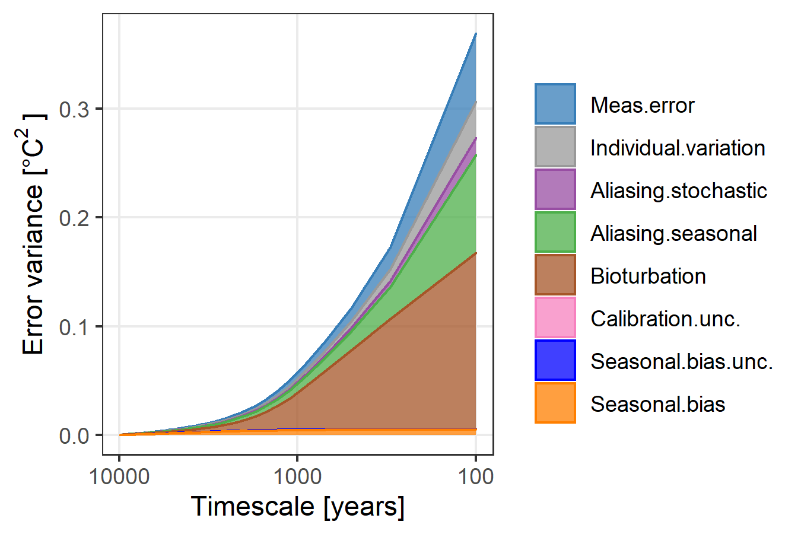

PSEM: Proxy Spectral Error Model.
=================================

------------------------------------------------------------------------

**psem** implements the Proxy Spectral Error Model described in the
discussion papers:

-   A spectral approach to estimating the timescale-dependent
    uncertainty of paleoclimate records – Part I: Theoretical concept.
    <a href="https://doi.org/10.5194/cp-16-1469-2020" class="uri">https://doi.org/10.5194/cp-16-1469-2020</a>

-   A spectral approach to estimating the timescale-dependent
    uncertainty of paleoclimate records – Part II: Application and
    interpretation.
    <a href="https://cp.copernicus.org/preprints/cp-2019-153/" class="uri">https://cp.copernicus.org/preprints/cp-2019-153/</a>

Please contact Dr Andrew Dolman
&lt;<a href="mailto:andrew.dolman@awi.de" class="email">andrew.dolman@awi.de</a>&gt;,
Prof. Thomas Laepple
&lt;<a href="mailto:tlaepple@awi.de" class="email">tlaepple@awi.de</a>&gt;,
or Dr Torben Kunz
&lt;<a href="mailto:tkunz@awi.de" class="email">tkunz@awi.de</a>&gt;, at
the Alfred-Wegener-Institute, Helmholtz Centre for Polar and Marine
Research, Germany, for more information.

This work was supported by German Federal Ministry of Education and
Research (BMBF) as Research for Sustainability initiative
[FONA](https://www.fona.de/) through the
[PalMod](https://www.palmod.de/) project (FKZ: 01LP1509C).

Installation
------------

**psem** can be installed directly from github

    if (!require("remotes")) {
      install.packages("remotes")
    }

    remotes::install_github("EarthSystemDiagnostics/psem")

Usage
-----

    library(psem)

### Parametrise a proxy error spectrum for a core at 45°N 0°E

#### Power spectrum for the stochastic climate

    # PSD Climate
    example.lat <- 45

    clim.spec.ex1 <- ModelSpectrum(
      freq = NULL,
      latitude = example.lat,
      variable = "temperature", beta = 1
    )

    p.clim.spec.ex1 <- PlotModelSpectrum(clim.spec.ex1)
    p.clim.spec.ex1

#### Amplitude of the seasonal cycle

    seasonal.amp <- AmpFromLocation(
      longitude = 0,
      latitude = example.lat,
      proxy.type = "degC",
      depth.upr = 0, depth.lwr = -50
    )

    ## Returning for closest available coordinates: longitude = -0.5, latitude = 44.5

#### Orbital modulation of the amplitude of the seasonal cycle

    orbital.pars <- RelativeAmplitudeModulation(
      latitude = example.lat,
      maxTimeKYear = 23,
      minTimeKYear = 1,
      bPlot = FALSE
    )

#### Get list of parameters

    # sediment accumulation rate for the core
    ex.sed.acc.rate <- 10

    spec.pars.ex1 <- GetSpecPars(
      proxy.type = "Mg_Ca",
      T = 1e04,
      delta_t = 100,
      tau_r = 100,
      sig.sq_a = orbital.pars$sig.sq_a,
      sig.sq_c = seasonal.amp$sig.sq_c,
      tau_b = 1000 * 10 / ex.sed.acc.rate,
      tau_s = 1000 * 1 / ex.sed.acc.rate,
      N = 30,
      tau_p = 7/12,
      phi_c = 0, delta_phi_c = 2 * pi / 3,
      phi_a = pi / 2,
      sigma.cal = 0.25,
      sigma.meas = 0.25,
      sigma.ind = 1,
      clim.spec.fun = "ModelSpectrum",
      clim.spec.fun.args =
        list(latitude = example.lat, beta = 1)
    )

#### Call `ProxyErrorSpectrum` with these parameters and plot it.

    proxy.err.spec <- do.call(ProxyErrorSpectrum, spec.pars.ex1)
    PlotSpecError(proxy.err.spec)

    ## Joining, by = c("component", "ax.grp")

    ## geom_path: Each group consists of only one observation. Do you need to adjust
    ## the group aesthetic?

#### Integrate the error spectrum to get timescale-dependent error.

    tsd.error.var <- IntegrateErrorSpectra(proxy.err.spec)
    PlotTSDVariance(tsd.error.var)

#### Get error for a record smoothed to a given timescale, here 500 years.

    err.500 <- GetProxyError(tsd.error.var, timescale = 500)
    knitr::kable(err.500, digits = 2)

<table>
<thead>
<tr class="header">
<th style="text-align: left;">smoothed.resolution</th>
<th style="text-align: left;">component</th>
<th style="text-align: right;">f.zero</th>
<th style="text-align: right;">inc.f.zero</th>
<th style="text-align: right;">exl.f.zero</th>
</tr>
</thead>
<tbody>
<tr class="odd">
<td style="text-align: left;">500</td>
<td style="text-align: left;">Aliasing.seasonal</td>
<td style="text-align: right;">0.03</td>
<td style="text-align: right;">0.13</td>
<td style="text-align: right;">0.13</td>
</tr>
<tr class="even">
<td style="text-align: left;">500</td>
<td style="text-align: left;">Aliasing.stochastic</td>
<td style="text-align: right;">0.01</td>
<td style="text-align: right;">0.06</td>
<td style="text-align: right;">0.06</td>
</tr>
<tr class="odd">
<td style="text-align: left;">500</td>
<td style="text-align: left;">Bioturbation</td>
<td style="text-align: right;">0.00</td>
<td style="text-align: right;">0.27</td>
<td style="text-align: right;">0.27</td>
</tr>
<tr class="even">
<td style="text-align: left;">500</td>
<td style="text-align: left;">Calibration.unc.</td>
<td style="text-align: right;">0.25</td>
<td style="text-align: right;">0.25</td>
<td style="text-align: right;">0.00</td>
</tr>
<tr class="odd">
<td style="text-align: left;">500</td>
<td style="text-align: left;">Individual.variation</td>
<td style="text-align: right;">0.02</td>
<td style="text-align: right;">0.08</td>
<td style="text-align: right;">0.08</td>
</tr>
<tr class="even">
<td style="text-align: left;">500</td>
<td style="text-align: left;">Meas.error</td>
<td style="text-align: right;">0.03</td>
<td style="text-align: right;">0.11</td>
<td style="text-align: right;">0.11</td>
</tr>
<tr class="odd">
<td style="text-align: left;">500</td>
<td style="text-align: left;">Reference.climate</td>
<td style="text-align: right;">NA</td>
<td style="text-align: right;">0.38</td>
<td style="text-align: right;">NA</td>
</tr>
<tr class="even">
<td style="text-align: left;">500</td>
<td style="text-align: left;">Seasonal.bias</td>
<td style="text-align: right;">1.37</td>
<td style="text-align: right;">1.37</td>
<td style="text-align: right;">0.07</td>
</tr>
<tr class="odd">
<td style="text-align: left;">500</td>
<td style="text-align: left;">Seasonal.bias.unc.</td>
<td style="text-align: right;">0.47</td>
<td style="text-align: right;">0.48</td>
<td style="text-align: right;">0.02</td>
</tr>
<tr class="even">
<td style="text-align: left;">500</td>
<td style="text-align: left;">Total.error</td>
<td style="text-align: right;">1.47</td>
<td style="text-align: right;">1.51</td>
<td style="text-align: right;">0.34</td>
</tr>
</tbody>
</table>
