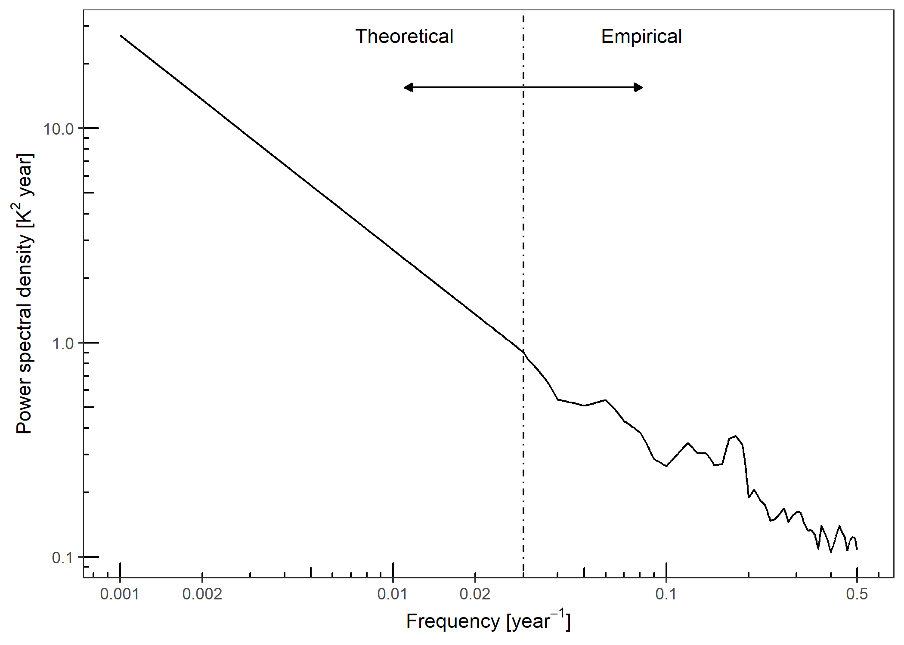

<!-- README.md is generated from README.Rmd. Please edit that file -->

# PSEM: Proxy Spectral Error Model.


**psem** implements the Proxy Spectral Error Model described in the
discussion papers:

-   A spectral approach to estimating the timescale-dependent
    uncertainty of paleoclimate records – Part I: Theoretical concept.
    <https://doi.org/10.5194/cp-16-1469-2020>

-   A spectral approach to estimating the timescale-dependent
    uncertainty of paleoclimate records – Part II: Application and
    interpretation. <https://cp.copernicus.org/preprints/cp-2019-153/>

Please contact Dr Andrew Dolman \<<andrew.dolman@awi.de>\>, Prof. Thomas
Laepple \<<tlaepple@awi.de>\>, or Dr Torben Kunz \<<tkunz@awi.de>\>, at
the Alfred-Wegener-Institute, Helmholtz Centre for Polar and Marine
Research, Germany, for more information.

This work was supported by German Federal Ministry of Education and
Research (BMBF) as Research for Sustainability initiative
[FONA](https://www.fona.de/) through the
[PalMod](https://www.palmod.de/) project (FKZ: 01LP1509C).

## Installation

**psem** can be installed directly from github

``` r
if (!require("remotes")) {
  install.packages("remotes")
}

remotes::install_github("EarthSystemDiagnostics/psem")
```

## Usage

``` r
library(psem)
```

### Parametrise a proxy error spectrum for a core at 45°N 0°E

#### Power spectrum for the stochastic climate

``` r
# PSD Climate
example.lat <- 45

clim.spec.ex1 <- ModelSpectrum(
  freq = NULL,
  latitude = example.lat,
  variable = "temperature", beta = 1
)

p.clim.spec.ex1 <- PlotModelSpectrum(clim.spec.ex1)
p.clim.spec.ex1
```



#### Amplitude of the seasonal cycle

``` r
seasonal.amp <- AmpFromLocation(
  longitude = 0,
  latitude = example.lat,
  proxy.type = "degC",
  depth.upr = 0, depth.lwr = -50
)
#> Returning for closest available coordinates: longitude = -0.5, latitude = 45.5
```

#### Orbital modulation of the amplitude of the seasonal cycle

``` r
orbital.pars <- RelativeAmplitudeModulation(
  latitude = example.lat,
  maxTimeKYear = 23,
  minTimeKYear = 1,
  bPlot = FALSE
)
```

#### Get list of parameters

``` r
# sediment accumulation rate for the core
ex.sed.acc.rate <- 10

spec.pars.ex1 <- GetSpecPars(
  proxy.type = "Mg_Ca",
  T = 1e04,
  delta_t = 100,
  tau_r = 100,
  sig.sq_a = orbital.pars$sig.sq_a,
  sig.sq_c = seasonal.amp$sig.sq_c,
  tau_b = 1000 * 10 / ex.sed.acc.rate,
  tau_s = 1000 * 1 / ex.sed.acc.rate,
  N = 30,
  tau_p = 7/12,
  phi_c = 0, delta_phi_c = 2 * pi / 3,
  phi_a = pi / 2,
  sigma.cal = 0.25,
  sigma.meas = 0.25,
  sigma.ind = 1,
  clim.spec.fun = "ModelSpectrum",
  clim.spec.fun.args =
    list(latitude = example.lat, beta = 1)
)
```

#### Call `ProxyErrorSpectrum` with these parameters and plot it.

``` r
proxy.err.spec <- do.call(ProxyErrorSpectrum, spec.pars.ex1)
PlotSpecError(proxy.err.spec)
#> Joining, by = c("component", "ax.grp")
#> geom_path: Each group consists of only one observation. Do you need to adjust
#> the group aesthetic?
```


#### Integrate the error spectrum to get timescale-dependent error.

``` r
tsd.error.var <- IntegrateErrorSpectra(proxy.err.spec)
PlotTSDVariance(tsd.error.var)
```


#### Get error for a record smoothed to a given timescale, here 500 years.

``` r
err.500 <- GetProxyError(tsd.error.var, timescale = 500)
knitr::kable(err.500, digits = 2)
```

| smoothed.resolution | component            | f.zero | inc.f.zero | exl.f.zero |
|:--------------------|:---------------------|-------:|-----------:|-----------:|
| 500                 | Aliasing.seasonal    |   0.04 |       0.18 |       0.17 |
| 500                 | Aliasing.stochastic  |   0.01 |       0.06 |       0.06 |
| 500                 | Bioturbation         |   0.00 |       0.27 |       0.27 |
| 500                 | Calibration.unc.     |   0.25 |       0.25 |       0.00 |
| 500                 | Individual.variation |   0.02 |       0.08 |       0.08 |
| 500                 | Meas.error           |   0.03 |       0.11 |       0.11 |
| 500                 | Reference.climate    |     NA |       0.38 |         NA |
| 500                 | Seasonal.bias        |   1.80 |       1.80 |       0.09 |
| 500                 | Seasonal.bias.unc.   |   0.62 |       0.62 |       0.03 |
| 500                 | Total.error          |   1.92 |       1.95 |       0.36 |
